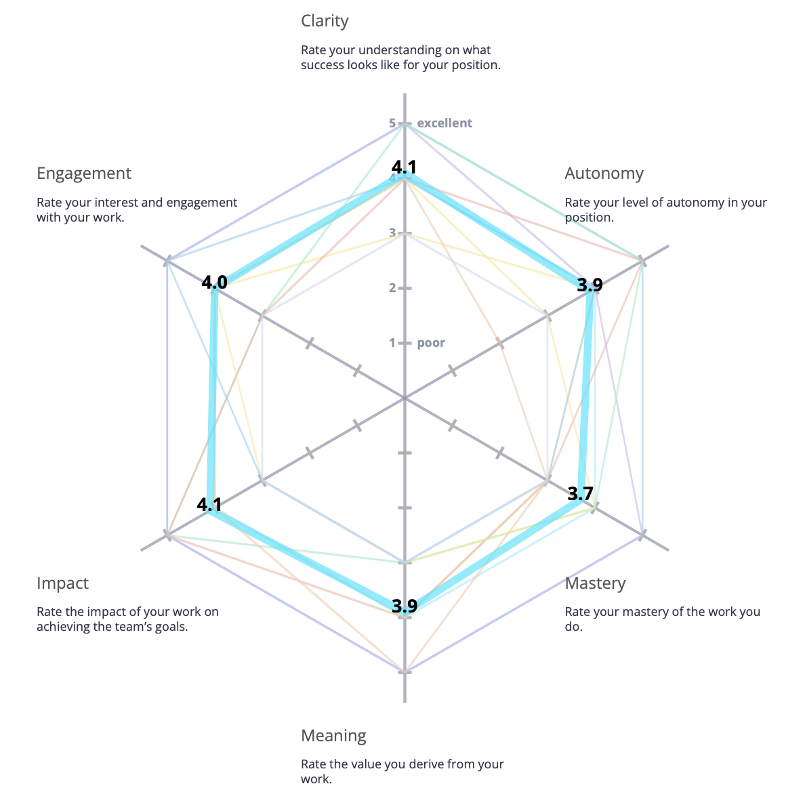
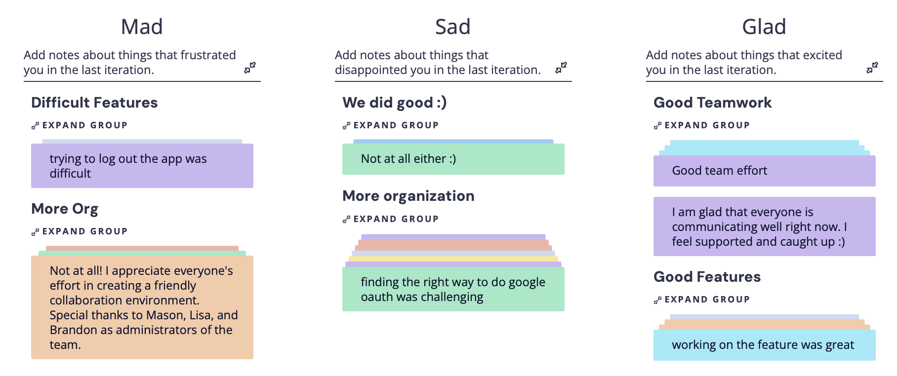

# Conductor - Sprint 1 Retrospective 11/10/2025

Date: 10 November 2025  
Meeting Type: Sprint Retrospective (via Zoom)  
Project: Conductor – Course Management Web Application

## Attendees

- Lisa Wang – Team Lead / Frontend Team
- Brandon Lai – Team Lead / Backend Team
- Zheng Yuan – Frontend Lead
- Jai Malegaonkar - Infrastructure Lead
- Mason Li – Project Manager / Backend Lead
- Jiesen Zhang – Infrastructure Team
- Dennis Chan - Infrastructure Team
- Chenhao Yan - Frontend Team
- Tian Zhang – Backend Team
- Saniya Patil – Backend Team
- Nikita Johny Kachappilly – Backend Team

## Overview

The goal of this retrospective was to examine our processes for our group's first sprint. We began the retrospective with a warm up excersize rating how we felt about the team's and our own performances. Next, we ran the "Mad, Sad, Glad" retrospective on Retrium, giving each other feedback on how we though we did things well, did not do things well, and what we could improve on. Finally, we came up with an action plan, listing several items were are interested in actively working on in the next sprint.

## Radar Warm Up

This is our team's radar warm up, with the average score displayed. Thankfully, in most areas we have good signals, although there are some lower values, such as poor autonomy. We have areas where tasks may be overly-constrained, and we aim to allow more flexibility in our upcoming sprint.

## Mad, Sad, Glad Retrospective

In our Mad, Sad, and Glad retrospective, we were quite happy to see a lot of good signals. We felt that we organized, came to agreement, and divided tasks well. What we struggled with was organization. In some cases we had commits/pushes that caused conflicts. Furthermore, we found some features quite difficult to implement, especially because they were somewhat open ended and unclear.

## Generated Action Items

Based off our discussion on the grouped items from our Mad, Sad, Glad retrospective, we came up with the following action items:
- Making Tasks More Clear
- Forbidding direct commits to main with PR protection rules
- Attempting rebase instead of merge to organize our git history tree
- Sharing meeting notes/key decisions between teams
- Prioritizing information and cohesiveness by making a more active effort to share important information, and responding when requests are made
- Performing sanity checks with stakeholders more often in order to ensure we are on the right path.
- Using JSDocs to document code
- Linting and testing code

## Summary

In review, we were fairly happy with how our first sprint went. Although it was not perfect, we were able to come to agreement in regards to what our weakest points were, and what should be done improve it in the next sprint. We are looking forward to our next sprint, and making our best effort to improve on the action items outlined.