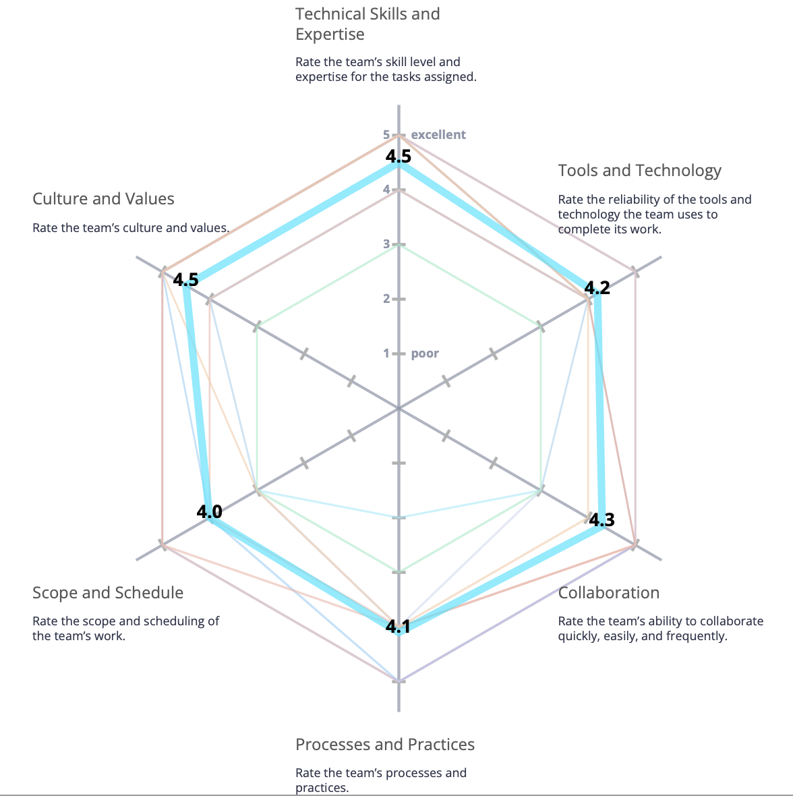
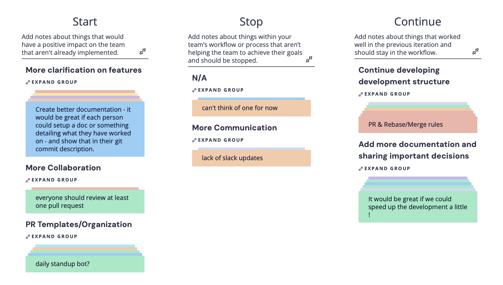

# Conductor - Sprint 2 Retrospective 11/17/2025

Date: 17 November 2025  
Meeting Type: Sprint Retrospective
Project: Conductor – Course Management Web Application

## Attendees

- Lisa Wang – Team Lead / Frontend Team
- Brandon Lai – Team Lead / Backend Team
- Zheng Yuan – Frontend Lead
- Jai Malegaonkar - Infrastructure Lead
- Mason Li – Project Manager / Backend Lead
- Jiesen Zhang – Infrastructure Team
- Dennis Chan - Infrastructure Team
- Chenhao Yan - Frontend Team
- Tian Zhang – Backend Team
- Saniya Patil – Backend Team
- Nikita Johny Kachappilly – Backend Team

## Overview

The goal of this retrospective was to examine our processes for our group's second sprint. We began the retrospective with a warm up excersize rating how we felt about the team's practices. Next, we ran the "Start, Stop, Continue" retrospective on Retrium, giving each other feedback on what we thought we should start doing, what we should stop, and what we should continue doing from previous retrospectives. Finally, we came up with an action plan, listing several items were are interested in actively working on in the next sprint.

## Radar Warm Up

This is our team's radar warm up, with the average score displayed. Thankfully, in most areas we have good signals, although we were markedly lower in our team processes. 

After discussion, we felt that this was fair, especially since our group still has somewhat weaker organization. We found that we were very interested in building stronger methods of organizing ourselves, such as templates to follow for pull requests.

## Start, Stop, Continue Retrospective

In our Start, Stop, and Continue retrospective, we felt that we recieved much good feedback. 

Again, we noted that an item which persisted from last retrospective was poor communication. This was also very related to the "More Collaboration" and "PR Template/Organization" groups in our retrospective. We felt that we were still not doing the greatest job in communicating key decisions and choices across our group. Thus, similar to our warm up, we were strongly interested in building more formal systems for recording decisions and ensuring that we are all on the same page.

Furthermore, we felt that our documentation was not strong enough. Along the items we wanted to continue from the previous sprint, we wanted to build more formal methods of recording what work had been done. This also tied in with our "Clarification on features" group, where we were interested in having the developers of features set up documentation on what they developed, and how to use it.

## Generated Action Items

Based off our discussion on the grouped items from our Start, Stop, and Continue retrospective, we came up with the following action items:
- Use GitHub Wiki to implement rich documentation for developed features.
    - This would be very helpful not only for development, but also continued maintenance. If significant documentation existed detailing how a module is implemented and how it behaves, it would make integration and support easier.
- Create a PR template.
    - This could help standardize how PRs are read, speeding up the process of review and understanding what work was done.
- Creating a channel specifically for PR requests.
    - This could help reduce the time until a PR is approved, as well as reducing clutter on PR review requests.
- Consider a formal system for assigning reviewers to PRs.
    - Again, this could help reduce confusion about who is supposed to review a request, and when.

## Summary

In review, we were okay with how our second sprint went. Again, we saw issues related to organization and documentation appear, so we really want to prioritize them in our following sprints. 

We generated action items based off our interest in strengthening our documentation, and are excited to see how we can implement our action items to achieve our goal.