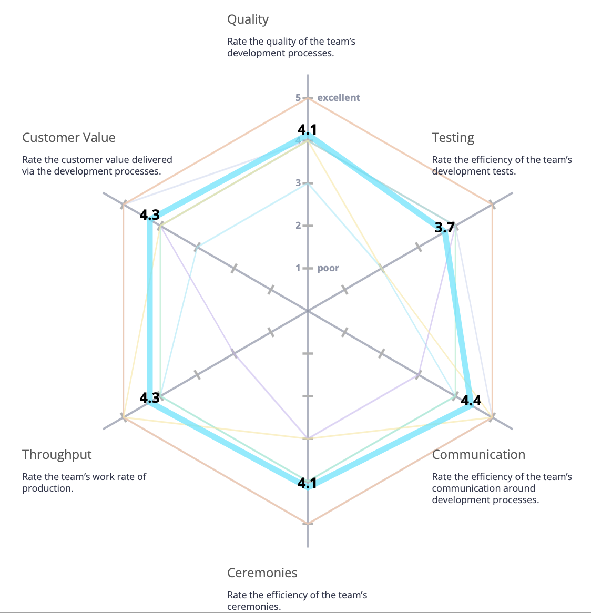
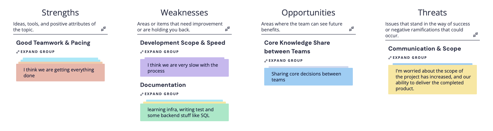

# Conductor - Sprint 3 Retrospective 11/24/2025

Date: 24 November 2025  
Meeting Type: Sprint Retrospective
Project: Conductor – Course Management Web Application

## Attendees

- Lisa Wang – Team Lead / Frontend Team
- Brandon Lai – Team Lead / Backend Team
- Zheng Yuan – Frontend Lead
- Jai Malegaonkar - Infrastructure Lead
- Mason Li – Project Manager / Backend Lead
- Jiesen Zhang – Infrastructure Team
- Dennis Chan - Infrastructure Team
- Chenhao Yan - Frontend Team
- Tian Zhang – Backend Team
- Saniya Patil – Backend Team
- Nikita Johny Kachappilly – Backend Team

## Overview

The goal of this retrospective was to examine our processes for our group's third sprint. First, we performed a warm up radar about about team's development practices. Next, we performed a "Stengths, Weakenesses, Opportunities, Threats retrospective to futher determine where our team's strongest development practices are, and where we need improvement. Finally, we distilled our notes into an action plan of items we wanted to see implemented.

## Radar Warm Up

For this development practices radar, we noticed we had two weaker standout areas on our testing and throughput areas.

After discussion, we felt that this was an accurate weakness point, since testing has been our least developed item as we focused mainly on delivering features. Futheremore, our development processes are tightly coupled, with some teams depending on others in order to test and verify their work.

Futhermore, we also felt that our provided customer value could be slightly weaker.

## Strengths, Weaknesses, Opportunitites, Threats Retrospective

Thus, we hoped to elaborate on our team radar with our SWOT retrospective.

Again, we were happy to see that most team members felt that we were doing a good job being supported, and that they felt like they had help when they needed it. 

However, we were concerned about the scope and speed of our development. Since our teams are highly developmentally coupled, although there are some items that can be accomplished independently, eventually we need to perform integration of our seperate modules. This is where we feel that we have issues, since our integration process has not been completely smooth. Coupled with the request for more features, such as health and monitoring, we are slightly worried about our ability to deliver the project completely on time.

Furthermore, as a remainder from last sprint, we were still concerned about our level of documentation and testing. While we have improved our JSDocs usage, we feel that we still do not have enough documentation to the point where it is very easy to "pick up and play" with unfamiliar modules.

Finally, our Opportunities and Threats both revolve around knowledge sharing and communication. Although we have increased meetings and begun cross-joining team channels on slack, we feel that there is still not enough shared record of decisions. 

## Generated Action Items

Based off our discussion on the grouped items from our SWOT retrospective, we came up with the following action items:
- Further JSDocs usage and automatic building into documentation on GitHub Wiki.
    - This will help with "pick up and play" when unifying seperate modules we have developed. Making it easier to integrate components will decrease our lead times and allow different teams to collaborate easier and faster. Furthermore, support for developed code will be made easier.
- Re-evaluate proposed features and remaining project timeline.
    - Re-evaluation will help us determine which features are the most important and cannot be dropped. The evaluation will help us ensure what to prioritize so that we deliver a product with components that the customer wants.
- Shared document for maintaining key design decisions.
    - A core document will help reduce potential miscommunications between teams. It will ensure that all teams understand what is promised by another team, ensuring that development can be done and worked on for modules that do not yet exist.
- More checks with Conductor stakeholders.
    - We need to hold more checks with project stakeholders. This will ensure we build the right product, and that our customers are happy with what we actually built.

## Summary

In review, we were okay with how our third sprint went. Again, we saw issues related to organization and documentation appear, which were directly impacting our ability to unify our codebase and merge all of our independently developed components into one system.

Our action items for this retrospective revolve around unifying our communication and documentation in order to better integrate our disparate parts. If we are able to make improvements in these areas, we feel that our final product will be better tested, more cohesive, and overall a stronger result.
