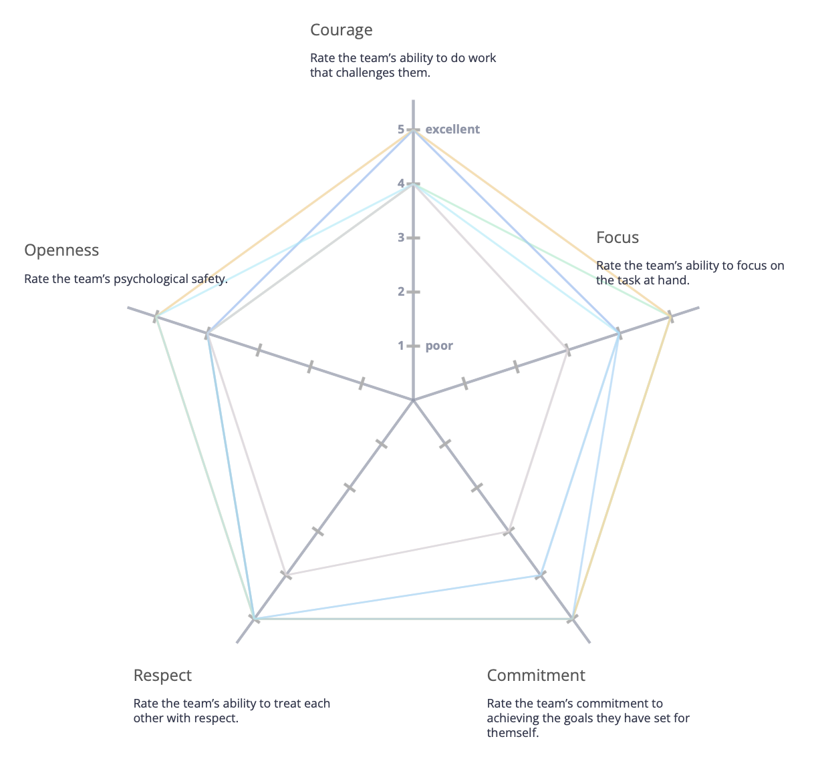
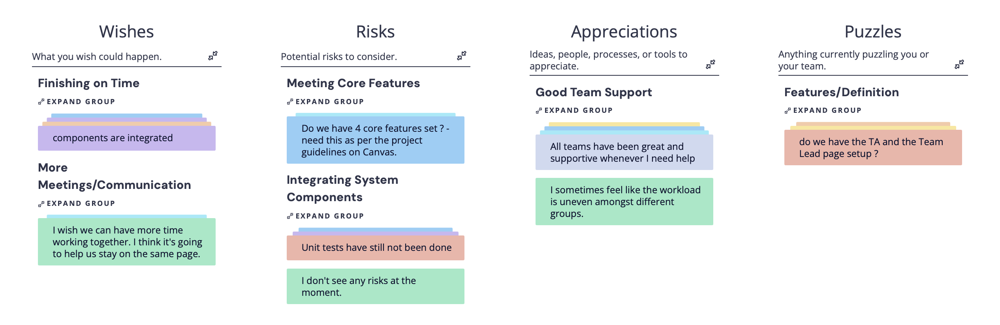

# Conductor - Sprint 3 Retrospective 11/24/2025

Date: 01 December 2025  
Meeting Type: Sprint Retrospective
Project: Conductor – Course Management Web Application

## Attendees

- Lisa Wang – Team Lead / Frontend Team
- Brandon Lai – Team Lead / Backend Team
- Zheng Yuan – Frontend Lead
- Jai Malegaonkar - Infrastructure Lead
- Mason Li – Project Manager / Backend Lead
- Jiesen Zhang – Infrastructure Team
- Dennis Chan - Infrastructure Team
- Chenhao Yan - Frontend Team
- Tian Zhang – Backend Team
- Saniya Patil – Backend Team
- Nikita Johny Kachappilly – Backend Team

## Overview

The goal of this retrospective was to examine our group's mood regarding the completion of Conductor. First, we performed a warm up radar about the team's beliefs on our own attitudes. Next, we performed a "Wishes, Risks, Appreciations, Puzzles" retrospective to futher determine where we felt we were currently in terms of delivering Conductor. Finally, we distilled our notes into an action plan of items we wanted to see implemented.

## Radar Warm Up

For this Scrum values radar, we noticed we had two weaker opinions about our focus and commitment.

After discussion, we felt that this was an accurate weakness point, since we have experienced trouble synchronizing all of our teams and ensuring tha teveryone is on the right page. We were concerned if this would affect our ability to deliver Conductor on time, which we further explored in our retrospective.

## Wishes, Risks, Appreciations, Puzzles

Thus, we hoped to elaborate on our team radar with our Wishes, Risks, Appreciations, and Puzzles retrospective.

As with earlier retrospectives, we were happy to see that most team members felt supported and were able to get help when they needed it.

However, we were very concerned about the scope of the project, and our ability to meet it. Although most of our features are completed, they stand independently and still need to be integrated into Conductor. Furthermore, we had concerns if we were meeting Conductor's four core features correctly.

Additionally, we had concerns about the synchronization between teams. Since we meet only twice per week, and virtually, we have had synchronization issues ensuring that everybody shares the same understanding of the project. This has lead to concerns that we are not working on the same items, and that the most important features/attributes of the project are not being prioritized.

Finally, we hoped to be able to add more testing than what we have now. Although we have the basic framework completed, we would like to add more comprehensive testing.

## Generated Action Items

Based off our discussion on the grouped items from our SWOT retrospective, we came up with the following action items:
- Additional (possibly in-person) Meetings to Synchronize Teams and important Development Items
    - These additional meetings will ensure that teams are coordinated on important features and decisions, as well as ensuring that the right tasks get prioritized. 
- Emphasize component integration.
    - Focusing on component integration instead of developing new features will help ensure that the system is more stable and resilient to problems in the future. Furthermore, it will ensure that we have a working, functional product at the conclusion of the course.
- Dedicating team members to testing.
    - Specifically having team members focus only on testing to help backfill needed tests, although somewhat unideal, will help us increase our test coverage to catch cases where our application misbehaves.
- Further reshaping of feature and project scope.
    - Further team meetings about core features will help ensure that we develop the right thing and that we deliver a complete product to the best of our ability.

## Summary

In review, we noted communication, feature scope, and testing as our main roadblocks in this fourth sprint. We saw this impact our development in slower integration, and confusion about how things should be unified.

Our action items for this retrospective mainly focus on ensuring the team is synchronized in order to deliver Conductor in a timely manner. We wanted to improve our shared understanding as a team in order to deliver Conductor to the best of our ability.
